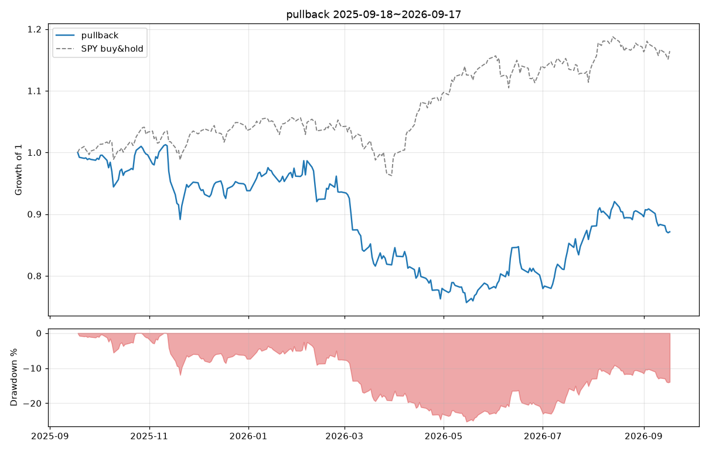
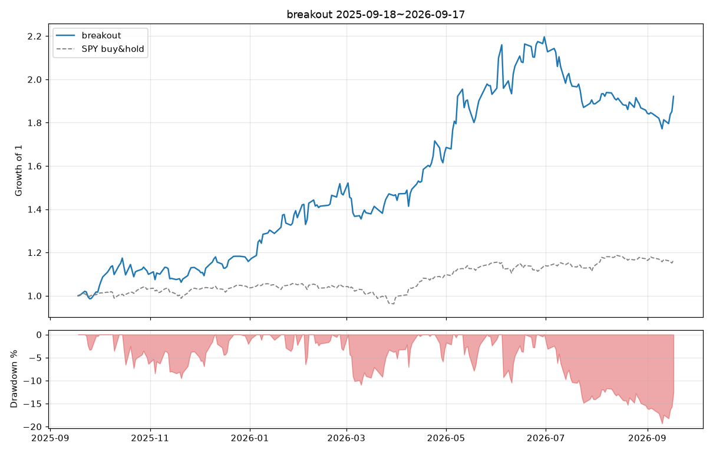
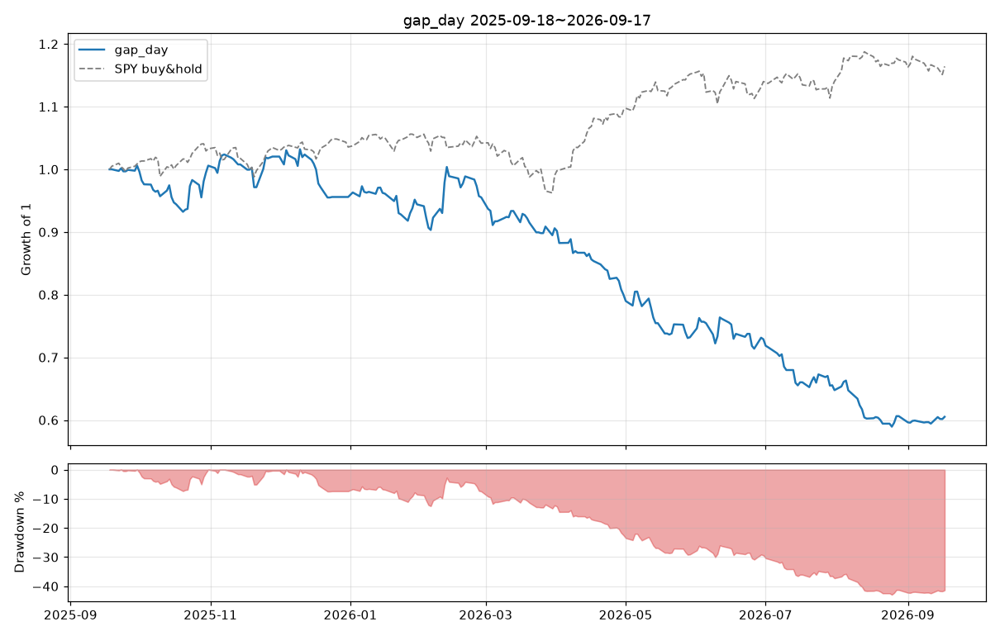

# 백테스트 2025-09-18 ~ 2026-09-17

설정: 초기자금 $100,000, 최대 10종목 동일비중, 슬리피지 10.0bp/체결, 수수료 $0.0/체결, 사이징 equal

## 전략 비교

| 지표 | pullback | breakout | gap_day |
|---|---|---|---|
| 시작 | 2025-09-18 | 2025-09-18 | 2025-09-18 |
| 종료 | 2026-09-17 | 2026-09-17 | 2026-09-17 |
| 총수익률 | -12.87% | 92.15% | -39.49% |
| CAGR | -12.92% | 92.65% | -39.61% |
| 샤프 | -0.63 | 2.13 | -2.43 |
| 최대낙폭(MDD) | -25.28% | -19.34% | -42.89% |
| 최장 낙폭기간(일) | 212 | 55 | 192 |
| 시장노출(일 비율) | 99.20% | 99.60% | 90.84% |
| 평균 보유종목수 | 9.88 | 9.79 | 5.40 |
| 거래횟수 | 583 | 141 | 1356 |
| 승률 | 60.03% | 39.72% | 33.48% |
| 평균 수익(승) | 2.46% | 23.32% | 4.56% |
| 평균 손실(패) | -4.20% | -6.80% | -2.80% |
| 손익비 | 0.58 | 3.43 | 1.63 |
| 프로핏팩터 | 0.85 | 2.12 | 0.83 |
| 기대수익/거래 | -0.20% | 5.16% | -0.34% |
| 평균 보유일 | 4.24 | 16.61 | 0.00 |
| 최고 거래 | 11.26% | 260.69% | 28.49% |
| 최악 거래 | -18.73% | -20.25% | -3.09% |
| SPY 총수익률 | 16.43% | 16.43% | 16.43% |
| SPY MDD | -8.88% | -8.88% | -8.88% |
| SPY 샤프 | 1.25 | 1.25 | 1.25 |

## pullback

파라미터: `{"rsi_len": 2, "rsi_entry": 10.0, "rsi_exit": 70.0, "trend_sma": 200, "exit_sma": 5, "max_hold_days": 10, "stop_atr_mult": null, "atr_len": 14, "min_price": 5.0, "min_dollar_volume": 10000000, "use_regime_filter": false, "rank_by": "rsi"}`

### 청산 사유별

| 청산 사유 | 건수 | 승률 | 평균수익 |
|---|---|---|---|
| end | 10 | 10.0% | -3.50% |
| signal | 543 | 64.3% | +0.43% |
| time | 30 | 0.0% | -10.67% |

### 월별 수익률

| 월 | 수익률 |
|---|---|
| 2025-09 | -0.95% |
| 2025-10 | +0.57% |
| 2025-11 | -4.45% |
| 2025-12 | -1.45% |
| 2026-01 | +2.51% |
| 2026-02 | -2.66% |
| 2026-03 | -10.99% |
| 2026-04 | -6.42% |
| 2026-05 | -0.14% |
| 2026-06 | +1.66% |
| 2026-07 | +11.24% |
| 2026-08 | +2.13% |
| 2026-09 | -3.10% |

## breakout

파라미터: `{"lookback": 20, "exit_lookback": 10, "vol_mult": 1.5, "vol_len": 20, "trend_sma_fast": 50, "trend_sma_slow": 200, "stop_atr_mult": 2.0, "trail_atr_mult": 3.0, "atr_len": 14, "max_hold_days": 60, "min_price": 5.0, "min_dollar_volume": 10000000, "use_regime_filter": true, "rank_by": "rs"}`

### 청산 사유별

| 청산 사유 | 건수 | 승률 | 평균수익 |
|---|---|---|---|
| end | 10 | 80.0% | +9.60% |
| signal | 20 | 35.0% | +1.78% |
| stop | 106 | 34.0% | +1.75% |
| time | 5 | 100.0% | +82.16% |

### 월별 수익률

| 월 | 수익률 |
|---|---|
| 2025-09 | +1.67% |
| 2025-10 | +8.09% |
| 2025-11 | +2.91% |
| 2025-12 | +2.43% |
| 2026-01 | +17.48% |
| 2026-02 | +7.73% |
| 2026-03 | +0.05% |
| 2026-04 | +13.09% |
| 2026-05 | +16.40% |
| 2026-06 | +13.76% |
| 2026-07 | -14.10% |
| 2026-08 | -1.55% |
| 2026-09 | +3.44% |

## gap_day

파라미터: `{"gap_pct": 0.04, "max_gap_pct": 0.3, "trend_sma": 200, "stop_pct": 0.03, "min_price": 5.0, "min_dollar_volume": 10000000, "use_regime_filter": false}`

### 청산 사유별

| 청산 사유 | 건수 | 승률 | 평균수익 |
|---|---|---|---|
| close | 588 | 77.2% | +3.26% |
| stop | 768 | 0.0% | -3.09% |

### 월별 수익률

| 월 | 수익률 |
|---|---|
| 2025-09 | +0.59% |
| 2025-10 | -0.00% |
| 2025-11 | +1.44% |
| 2025-12 | -6.32% |
| 2026-01 | -1.23% |
| 2026-02 | +1.19% |
| 2026-03 | -5.16% |
| 2026-04 | -11.69% |
| 2026-05 | -8.49% |
| 2026-06 | -0.44% |
| 2026-07 | -11.14% |
| 2026-08 | -7.56% |
| 2026-09 | +1.07% |
