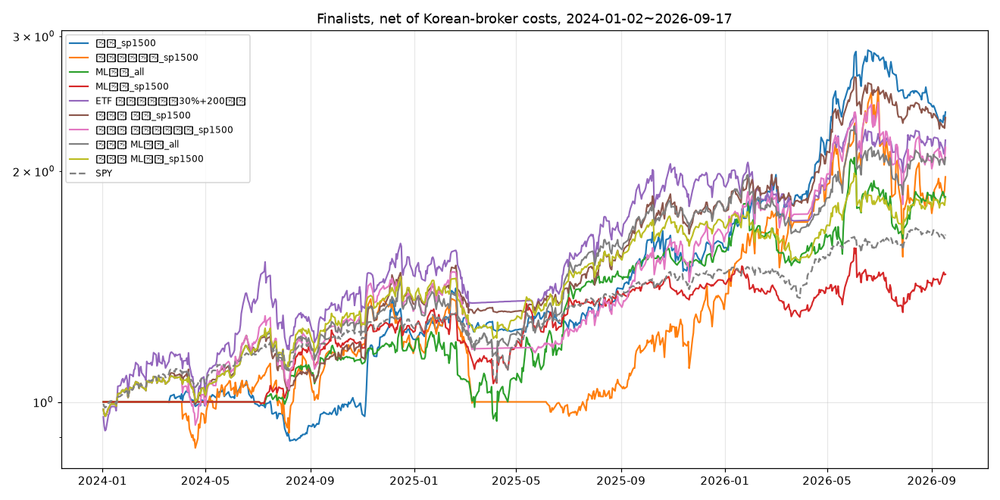

# 수익 극대화 모델 후보 리더보드 (국내 증권사 비용: 수수료 편도 0.25% + 슬리피지)

## 1. 종목 전략 (미국 전 종목 일봉, 최대 10~20종목 동일비중, 포지션 ≤ 20일 평균거래대금 1%)

각 전략의 파라미터 격자 중 **2024·2025·2026 모두 수익 > 0** 인 설정만 후보로 두고, 전체 기간 수익률이 가장 높은 설정을 대표로 뽑았다(연도별 일관성 우선).

| 전략 | 세 해 모두 + / 격자 | 대표 설정 | 2024 | 2025 | 2026 YTD | 전체(2023-11~) | 전체 MDD | 전체 승률 | 거래 |
|---|---|---|---|---|---|---|---|---|---|
| breakout | 0 / 8 | `lookback=20.0, trail_atr_mult=3.0, max_hold_days=120.0` | -19.8% | -35.8% | -43.6% | -60.3% | -65.6% | 32.1% | 380 |
| breakout_sp1500 | 5 / 8 | `lookback=20.0, trail_atr_mult=3.0, min_dollar_volume=50000000.0` | +20.7% | +19.7% | +36.1% | +138.8% | -20.3% | 37.4% | 313 |
| high_breakout | 0 / 8 | `lookback=252.0, trail_atr_mult=5.0, exit_below_sma=nan` | -12.5% | -29.8% | -20.1% | -31.9% | -45.9% | 28.0% | 157 |
| high_breakout_sp1500 | 3 / 8 | `lookback=126.0, trail_atr_mult=3.0, exit_below_sma=nan` | +25.1% | +1.0% | +3.0% | +36.3% | -25.5% | 37.9% | 253 |
| ml_rank | 3 / 24 | `top_n=10, rebalance_days=21, trail_atr_mult=4.0, use_regime_filter=False` | +12.7% | +16.7% | +6.4% | +45.0% | -14.6% | 58.3% | 252 |
| ml_rank_sp1500 | 5 / 24 | `top_n=20, rebalance_days=21, trail_atr_mult=4.0, use_regime_filter=False` | +23.3% | +15.1% | +1.4% | +46.7% | -20.1% | 52.7% | 461 |
| pead | 0 / 18 | `min_ret=0.03, max_hold_days=40.0, trail_atr_mult=5.0` | -10.7% | -16.9% | +24.5% | +5.0% | -37.0% | 33.3% | 234 |
| pead_sp1500 | 0 / 18 | `min_ret=0.05, max_hold_days=40.0, trail_atr_mult=5.0` | -6.8% | -8.9% | -5.0% | -16.9% | -29.5% | 34.9% | 195 |
| xs_momentum | 0 / 16 | `lookback=252, top_n=20, rank_by=mom_vol, trail_atr_mult=4.0` | +14.2% | -12.4% | +28.0% | +39.2% | -37.6% | 44.6% | 278 |
| xs_momentum_sp1500 | 6 / 16 | `lookback=126, top_n=20, rank_by=mom, trail_atr_mult=nan` | +15.7% | +8.2% | +26.0% | +96.6% | -39.9% | 54.4% | 204 |

## 2. ETF 장기 검증 (2005~2026)

| 전략 | 기간 | CAGR | MDD | 샤프 | 최근3년 | 최근1년 |
|---|---|---|---|---|---|---|
| 바이앤홀드 SPY | 2005-01-03~2026-09-18 | +10.9% | -55.2% | 0.64 | +77.3% | +16.5% |
| 바이앤홀드 QQQ | 2005-01-03~2026-09-18 | +15.2% | -53.4% | 0.76 | +97.0% | +22.3% |
| 바이앤홀드 TQQQ | 2010-02-11~2026-09-18 | +42.4% | -81.7% | 0.89 | +273.0% | +46.7% |
| 200일선 필터 SPY (월말 판정) | 2005-10-18~2026-09-18 | +9.2% | -25.7% | 0.77 | +38.3% | +5.1% |
| 200일선 필터 QQQ (월말 판정) | 2005-10-18~2026-09-18 | +12.6% | -28.6% | 0.79 | +52.3% | +5.4% |
| 200일선 필터 TQQQ (월말 판정) | 2010-11-26~2026-09-18 | +24.9% | -69.9% | 0.70 | +68.6% | -4.1% |
| 200일선 필터 QLD (월말 판정) | 2007-04-10~2026-09-18 | +16.7% | -51.9% | 0.63 | +79.9% | +2.3% |
| 듀얼 모멘텀 (SPY/QQQ/EFA vs TLT, 월간) | 2006-01-31~2026-09-18 | +12.3% | -32.0% | 0.70 | +78.4% | +29.8% |
| 변동성 타게팅 20% + 200일선 (TQQQ 근사, 주간) | 2005-10-18~2026-09-18 | +16.3% | -27.9% | 0.85 | +100.2% | +14.1% |
| 변동성 타게팅 30% + 200일선 (TQQQ 근사, 주간) | 2005-10-18~2026-09-18 | +21.9% | -39.2% | 0.83 | +165.2% | +21.4% |

## 연도별 수익률

| 전략 | 2005 | 2006 | 2007 | 2008 | 2009 | 2010 | 2011 | 2012 | 2013 | 2014 | 2015 | 2016 | 2017 | 2018 | 2019 | 2020 | 2021 | 2022 | 2023 | 2024 | 2025 | 2026 |
|---|---|---|---|---|---|---|---|---|---|---|---|---|---|---|---|---|---|---|---|---|---|---|
| 바이앤홀드 SPY | +5% | +16% | +5% | -37% | +26% | +15% | +2% | +16% | +32% | +13% | +1% | +12% | +22% | -5% | +31% | +18% | +29% | -18% | +26% | +25% | +18% | +12% |
| 바이앤홀드 QQQ | +3% | +7% | +19% | -42% | +55% | +20% | +3% | +18% | +37% | +19% | +9% | +7% | +33% | -0% | +39% | +48% | +27% | -33% | +55% | +26% | +21% | +17% |
| 바이앤홀드 TQQQ | - | - | - | - | - | +78% | -8% | +52% | +140% | +57% | +17% | +11% | +118% | -20% | +134% | +110% | +83% | -79% | +198% | +58% | +34% | +36% |
| 200일선 필터 SPY (월말 판정) | +4% | +16% | +5% | +1% | +19% | +7% | -2% | +14% | +32% | +13% | -6% | +10% | +22% | -7% | +8% | +18% | +29% | -21% | +8% | +25% | +11% | +1% |
| 200일선 필터 QQQ (월말 판정) | +4% | +5% | +19% | -19% | +34% | -4% | -3% | +10% | +37% | +19% | -1% | -2% | +33% | +10% | +24% | +28% | +27% | -8% | +40% | +26% | +8% | +1% |
| 200일선 필터 TQQQ (월말 판정) | - | - | - | - | - | +14% | -7% | +18% | +122% | +57% | -11% | -23% | +118% | +13% | +15% | +19% | +83% | -25% | +83% | +58% | -7% | -11% |
| 200일선 필터 QLD (월말 판정) | - | - | +17% | -37% | +55% | +4% | -8% | +11% | +72% | +38% | -5% | -20% | +70% | +13% | +11% | +44% | +55% | -16% | +55% | +43% | +9% | -4% |
| 듀얼 모멘텀 (SPY/QQQ/EFA vs TLT, 월간) | - | +19% | +12% | +15% | -9% | +20% | +3% | +16% | +15% | +19% | +9% | -3% | +28% | -0% | +12% | +48% | +26% | -25% | +18% | +19% | +12% | +21% |
| 변동성 타게팅 20% + 200일선 (TQQQ 근사, 주간) | +4% | +13% | +21% | -10% | +31% | +11% | -16% | +11% | +46% | +22% | -3% | -10% | +80% | +5% | +22% | +33% | +27% | -9% | +42% | +33% | +19% | +12% |
| 변동성 타게팅 30% + 200일선 (TQQQ 근사, 주간) | +6% | +15% | +28% | -16% | +48% | +14% | -26% | +13% | +74% | +32% | -6% | -11% | +107% | +3% | +30% | +48% | +39% | -14% | +62% | +46% | +31% | +15% |

주의: TQQQ 근사(QQQ 일수익률×3 − 연 1%)는 실제 TQQQ(2010~)와 거의 같지만 2008년 같은 급락기의 변동성 손실을 과소평가할 수 있다. 레버리지 ETF 는 MDD 가 -70~-90% 까지 갈 수 있다.


## 3. 최종 후보 비교 (2024-01~2026-09 연속 운용, 국내 증권사 비용, 50/50 블렌드 포함)


| 모델 | 총수익 | CAGR | MDD | 샤프 | 2024 | 2025 | 2026 | 승률 | 거래 | 평균보유일 |
|---|---|---|---|---|---|---|---|---|---|---|
| 돌파_sp1500 | +138.8% | +38.1% | -20.3% | 1.41 | +20.7% | +31.5% | +50.5% | 37.4% | 313 | 18 |
| 횡단면모멘텀_sp1500 | +96.6% | +28.5% | -39.9% | 0.83 | +15.7% | +14.1% | +48.9% | 54.4% | 204 | 53 |
| ML랭커_all | +85.1% | +25.6% | -24.9% | 1.00 | +16.4% | +34.8% | +18.0% | 57.5% | 228 | 21 |
| ML랭커_sp1500 | +46.7% | +15.3% | -20.1% | 0.81 | +23.3% | +15.9% | +2.6% | 52.7% | 461 | 21 |
| ETF 변동성타게팅30%+200일선 | +119.5% | +33.8% | -23.1% | 1.11 | +46.2% | +31.0% | +14.6% | - | 0 | - |
| SPY 바이앤홀드 | +65.3% | +20.5% | -18.8% | 1.27 | +24.9% | +17.7% | +12.4% | - | 0 | - |
| 블렌드 50% 돌파_sp1500 + 50% ETF | +134.9% | +37.2% | -15.9% | 1.42 | +34.3% | +32.2% | +32.3% | - | 0 | - |
| 블렌드 50% 횡단면모멘텀_sp1500 + 50% ETF | +114.8% | +32.8% | -26.4% | 1.06 | +31.3% | +23.2% | +32.8% | - | 0 | - |
| 블렌드 50% ML랭커_all + 50% ETF | +108.4% | +31.3% | -20.3% | 1.26 | +32.0% | +34.7% | +17.2% | - | 0 | - |
| 블렌드 50% ML랭커_sp1500 + 50% ETF | +84.3% | +25.4% | -16.9% | 1.16 | +35.8% | +24.6% | +9.0% | - | 0 | - |



## 4. 결론과 권고

**최고 수익·최고 위험조정 모두 "돌파_sp1500 50% + ETF 변동성타게팅 50%" 블렌드**: 총 +135%(CAGR 37%), MDD −16%, 샤프 1.42, 2024/2025/2026 각 +34/+32/+32%.

- **ETF 레그(변동성 타게팅 30% + 200일선, TQQQ 실행)**: 2005~2026 20년 검증에서 CAGR 22%, MDD −39%, 샤프 0.83. 규칙 단순, 월 1~4회 거래로 수수료 영향 미미. 통계적으로 가장 믿을 만한 레그.
- **돌파 레그(S&P 1500, 20일 고가 돌파·거래량 1.5배·정배열·SPY>200일선, 2×ATR 손절·3×ATR 트레일, 거래대금 ≥ $50M, 10종목)**: 2024 +21%, 2025 +20%, 2026 +36%(격자 8개 중 5개가 세 해 모두 양수). 단, **상위 10건이 전체 손익의 105%**(MRVL +260%, APP +291% 등), 중앙값 거래 −2.9%, 승률 37% — 추세추종의 본질대로 소수 대박에 의존하므로 몇 달 단위로는 손실이 정상이다.
- ML 랭커(20일 보유)는 승률 55~58%·MDD −15~−25%로 가장 안정적이지만 수익률은 낮다(CAGR 15~26%). 안정형이 필요하면 ETF 레그와 블렌드(CAGR 31%, MDD −20%).
- 미국 전 종목(동전주 포함) 유니버스에서는 모든 종목 전략이 세 해 연속 양수를 만들지 못했다. **유동성 큰 종목(S&P 1500, 거래대금 ≥ $50M)만 쓰는 것이 핵심**.

### 운용 방법
```bash
# 돌파 레그 (매일 미국장 마감 후, 기본 dry-run → KIS 모의투자 → 실계좌)
python scripts/run_daily.py --strategy breakout --universe sp1500 --max-positions 10 \
   --param lookback=20 --param trail_atr_mult=3.0 --param min_dollar_volume=50000000 --broker kis --live
# ETF 레그 (주 1회, 금요일 마감 후 목표 비중 확인 → TQQQ 비중 조정)
python scripts/etf_signal.py --target 0.30
```

### 반드시 알아둘 것
- 검증 기간 2.7년은 강세장(SPY +65%)이다. 2022년 같은 해에는 ETF 레그 −14%, 돌파 레그는 레짐 필터로 대부분 현금이지만 손실 가능.
- 돌파 레그는 경로 의존이 커서 같은 규칙도 시작 시점에 따라 연 수익이 ±10%p 이상 달라진다(2025년: 격자 +19.7% vs 연속 운용 +31.5%).
- S&P 1500 '현재' 구성종목 기준이라 생존 편향이 있다. TQQQ 근사(QQQ×3−연 1%)는 실제 TQQQ 와 거의 같지만 급락기 손실을 과소평가할 수 있다.
- 레버리지 ETF 는 하루 −30% 이상 급락하는 해가 있다(2022 −79% B&H). 변동성 타게팅이 이를 −14%로 줄였지만 보장은 아니다.
