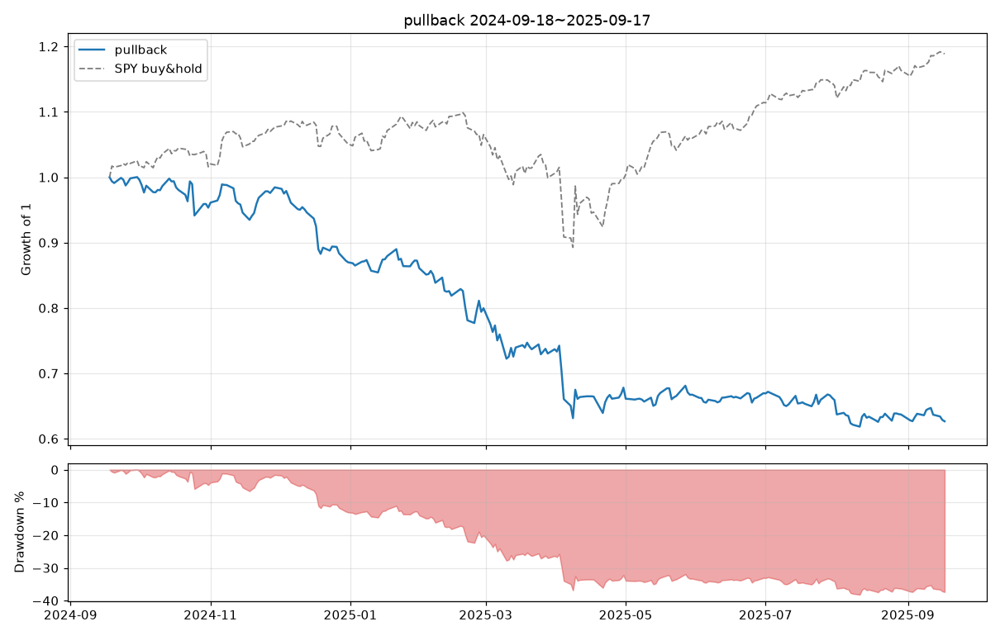
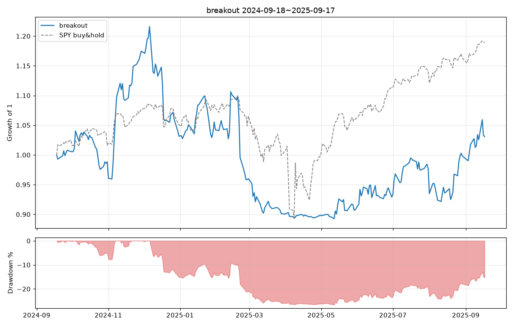

# 백테스트 2024-09-18 ~ 2025-09-17

유니버스 sp1500 (1505종목) · 초기자금 $100,000 · 최대 10종목 동일비중 · 슬리피지 10.0bp/체결(주가<$5: 50.0bp) · 수수료 편도 0.25% + $0.0/체결 · 포지션 상한 = 20일 평균거래대금의 1%

## 전략 비교

| 지표 | pullback | breakout |
|---|---|---|
| 시작 | 2024-09-18 | 2024-09-18 |
| 종료 | 2025-09-17 | 2025-09-17 |
| 총수익률 | -37.33% | 3.07% |
| CAGR | -37.57% | 3.10% |
| 샤프 | -2.05 | 0.25 |
| 최대낙폭(MDD) | -38.17% | -26.60% |
| 최장 낙폭기간(일) | 241 | 193 |
| 시장노출(일 비율) | 98.40% | 99.60% |
| 평균 보유종목수 | 9.63 | 8.59 |
| 거래횟수 | 583 | 135 |
| 승률 | 50.09% | 31.85% |
| 평균 수익(승) | 2.15% | 15.02% |
| 평균 손실(패) | -3.72% | -6.41% |
| 손익비 | 0.58 | 2.35 |
| 프로핏팩터 | 0.57 | 1.05 |
| 기대수익/거래 | -0.78% | 0.42% |
| 평균 보유일 | 4.11 | 15.10 |
| 최고 거래 | 24.39% | 108.30% |
| 최악 거래 | -52.11% | -16.16% |
| SPY 총수익률 | 18.88% | 18.88% |
| SPY MDD | -18.76% | -18.76% |
| SPY 샤프 | 0.99 | 0.99 |

## pullback

파라미터: `{"rsi_len": 2, "rsi_entry": 10.0, "rsi_exit": 70.0, "trend_sma": 200, "exit_sma": 5, "max_hold_days": 10, "stop_atr_mult": null, "atr_len": 14, "min_price": 5.0, "min_dollar_volume": 10000000, "max_mcap": null, "min_mcap": null, "use_regime_filter": false, "rank_by": "rsi"}`

### 청산 사유별

| 청산 사유 | 건수 | 승률 | 평균수익 |
|---|---|---|---|
| end | 10 | 10.0% | -3.09% |
| signal | 553 | 52.6% | -0.30% |
| time | 20 | 0.0% | -12.91% |

### 월별 수익률

| 월 | 수익률 |
|---|---|
| 2024-09 | +0.02% |
| 2024-10 | -4.68% |
| 2024-11 | +3.27% |
| 2024-12 | -11.65% |
| 2025-01 | -1.03% |
| 2025-02 | -7.11% |
| 2025-03 | -7.84% |
| 2025-04 | -7.98% |
| 2025-05 | -1.58% |
| 2025-06 | +0.33% |
| 2025-07 | -1.56% |
| 2025-08 | -3.35% |
| 2025-09 | -1.64% |

## breakout

파라미터: `{"lookback": 20, "exit_lookback": 10, "vol_mult": 1.5, "vol_len": 20, "trend_sma_fast": 50, "trend_sma_slow": 200, "stop_atr_mult": 2.0, "trail_atr_mult": 3.0, "atr_len": 14, "max_hold_days": 60, "min_price": 5.0, "min_dollar_volume": 10000000, "max_mcap": null, "min_mcap": null, "use_regime_filter": true, "rank_by": "rs"}`

### 청산 사유별

| 청산 사유 | 건수 | 승률 | 평균수익 |
|---|---|---|---|
| end | 10 | 80.0% | +10.49% |
| signal | 23 | 43.5% | +5.67% |
| stop | 98 | 22.4% | -2.36% |
| time | 4 | 75.0% | +13.15% |

### 월별 수익률

| 월 | 수익률 |
|---|---|
| 2024-09 | +0.58% |
| 2024-10 | -1.74% |
| 2024-11 | +18.85% |
| 2024-12 | -12.19% |
| 2025-01 | +1.07% |
| 2025-02 | -7.90% |
| 2025-03 | -6.22% |
| 2025-04 | -0.24% |
| 2025-05 | +1.08% |
| 2025-06 | +2.31% |
| 2025-07 | +5.18% |
| 2025-08 | +2.18% |
| 2025-09 | +3.24% |
