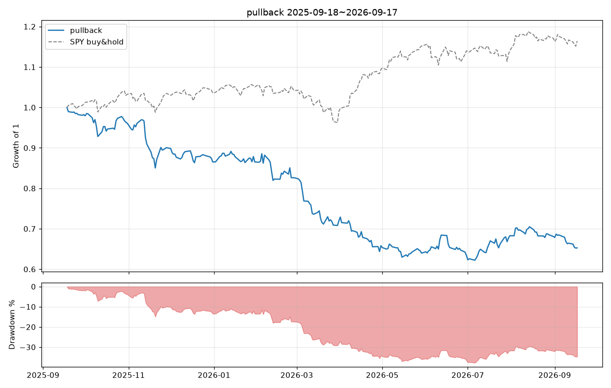
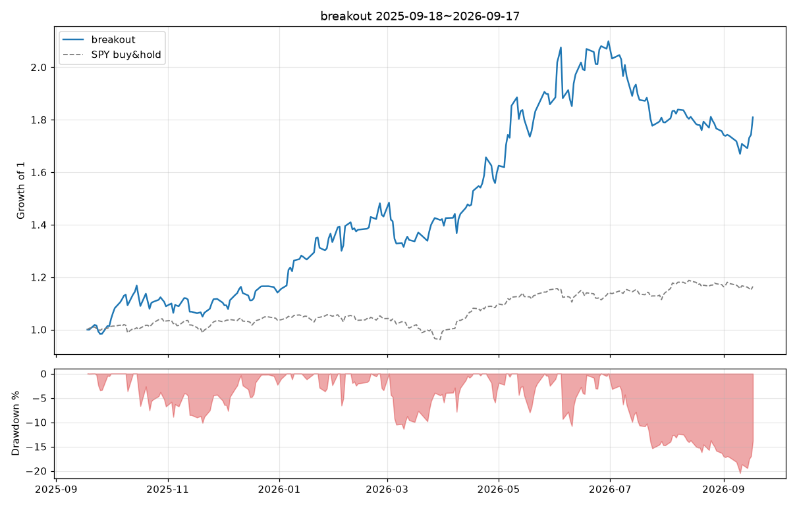

# 백테스트 2025-09-18 ~ 2026-09-17

유니버스 sp1500 (1505종목) · 초기자금 $100,000 · 최대 10종목 동일비중 · 슬리피지 10.0bp/체결(주가<$5: 50.0bp) · 수수료 편도 0.25% + $0.0/체결 · 포지션 상한 = 20일 평균거래대금의 1%

## 전략 비교

| 지표 | pullback | breakout |
|---|---|---|
| 시작 | 2025-09-18 | 2025-09-18 |
| 종료 | 2026-09-17 | 2026-09-17 |
| 총수익률 | -34.73% | 80.89% |
| CAGR | -34.84% | 81.31% |
| 샤프 | -2.14 | 1.94 |
| 최대낙폭(MDD) | -37.78% | -20.46% |
| 최장 낙폭기간(일) | 250 | 55 |
| 시장노출(일 비율) | 99.20% | 99.60% |
| 평균 보유종목수 | 9.88 | 9.79 |
| 거래횟수 | 583 | 141 |
| 승률 | 52.83% | 39.72% |
| 평균 수익(승) | 2.25% | 22.80% |
| 평균 손실(패) | -4.00% | -7.27% |
| 손익비 | 0.56 | 3.13 |
| 프로핏팩터 | 0.60 | 1.96 |
| 기대수익/거래 | -0.70% | 4.67% |
| 평균 보유일 | 4.24 | 16.61 |
| 최고 거래 | 10.73% | 259.54% |
| 최악 거래 | -19.18% | -20.70% |
| SPY 총수익률 | 16.43% | 16.43% |
| SPY MDD | -8.88% | -8.88% |
| SPY 샤프 | 1.25 | 1.25 |

## pullback

파라미터: `{"rsi_len": 2, "rsi_entry": 10.0, "rsi_exit": 70.0, "trend_sma": 200, "exit_sma": 5, "max_hold_days": 10, "stop_atr_mult": null, "atr_len": 14, "min_price": 5.0, "min_dollar_volume": 10000000, "max_mcap": null, "min_mcap": null, "use_regime_filter": false, "rank_by": "rsi"}`

### 청산 사유별

| 청산 사유 | 건수 | 승률 | 평균수익 |
|---|---|---|---|
| end | 10 | 10.0% | -3.75% |
| signal | 543 | 56.5% | -0.07% |
| time | 30 | 0.0% | -11.14% |

### 월별 수익률

| 월 | 수익률 |
|---|---|
| 2025-09 | -1.78% |
| 2025-10 | -2.14% |
| 2025-11 | -6.31% |
| 2025-12 | -3.91% |
| 2026-01 | -0.01% |
| 2026-02 | -4.50% |
| 2026-03 | -12.92% |
| 2026-04 | -8.53% |
| 2026-05 | -2.79% |
| 2026-06 | -0.91% |
| 2026-07 | +7.72% |
| 2026-08 | -0.26% |
| 2026-09 | -4.15% |

## breakout

파라미터: `{"lookback": 20, "exit_lookback": 10, "vol_mult": 1.5, "vol_len": 20, "trend_sma_fast": 50, "trend_sma_slow": 200, "stop_atr_mult": 2.0, "trail_atr_mult": 3.0, "atr_len": 14, "max_hold_days": 60, "min_price": 5.0, "min_dollar_volume": 10000000, "max_mcap": null, "min_mcap": null, "use_regime_filter": true, "rank_by": "rs"}`

### 청산 사유별

| 청산 사유 | 건수 | 승률 | 평균수익 |
|---|---|---|---|
| end | 10 | 80.0% | +9.35% |
| signal | 20 | 35.0% | +1.27% |
| stop | 106 | 34.0% | +1.25% |
| time | 5 | 100.0% | +81.46% |

### 월별 수익률

| 월 | 수익률 |
|---|---|
| 2025-09 | +1.28% |
| 2025-10 | +7.50% |
| 2025-11 | +2.58% |
| 2025-12 | +2.15% |
| 2026-01 | +16.85% |
| 2026-02 | +7.32% |
| 2026-03 | -0.67% |
| 2026-04 | +12.54% |
| 2026-05 | +16.20% |
| 2026-06 | +12.95% |
| 2026-07 | -14.76% |
| 2026-08 | -1.86% |
| 2026-09 | +3.01% |
